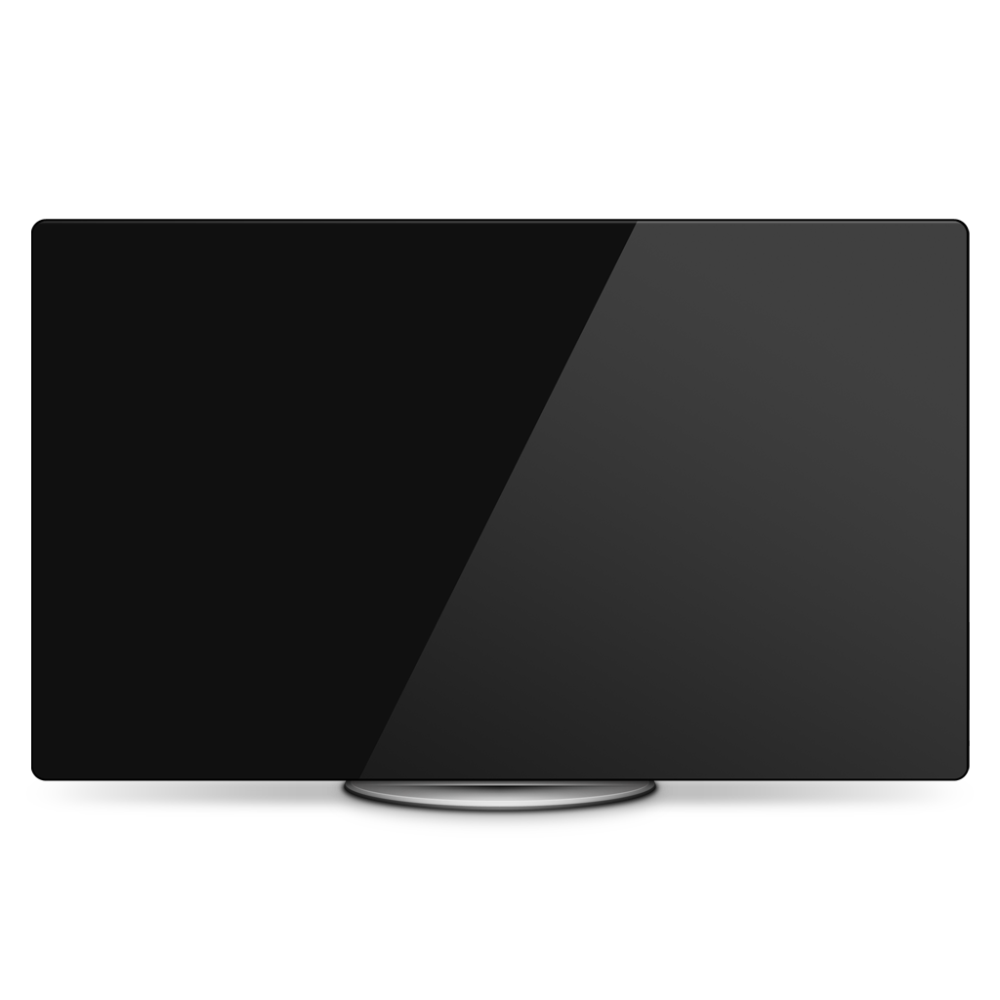

# Resolved.app

<p align="center">

</p>

Resolved is a macOS app for switching between available display modes on the primary display.

Resolved contains the following:

- **Resolved**: a system-wide menu bar application
- **ResolvedCLI**: a command-line utility

# Usage

## Resolved

To change the display mode, select it from the menu. Changes made here persist for the current login session only.


## ResolvedCLI

ResolvedCLI is located inside the Resolved app bundle. Changes made here persist between login sessions.

### Examples

Show help information for the command-line utility.

```bash
$ ./ResolvedCLI --help
```

Show help information for a subcommand.

```bash
$ ./ResolvedCLI <subcommand> --help
```

List available display modes.

```bash
$ ./ResolvedCLI list
```

Set the display mode.

```bash
$ ./ResolvedCLI set <mode>
$ ./ResolvedCLI <mode>
```

Set the display mode for the current login session only.

```bash
$ ./ResolvedCLI set <mode> --session-only
```
